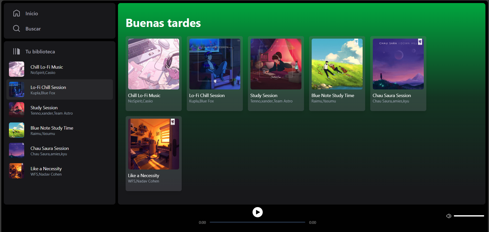
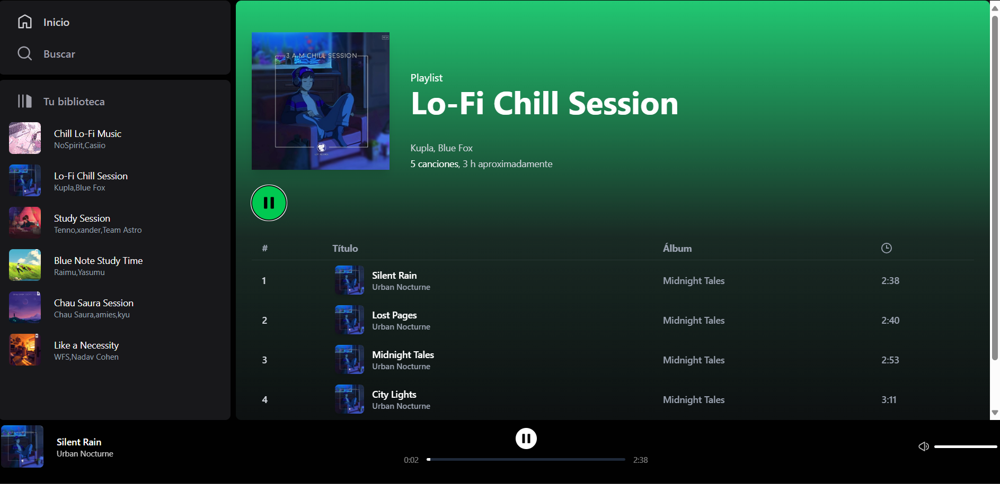

# Spotify Clone 🎧

Este es un clon funcional de la interfaz de Spotify, desarrollado con [Astro](https://astro.build), [Svelte](https://svelte.dev) y [Tailwind CSS](https://tailwindcss.com).

## Características

- Navegación de playlists
- Interfaz inspirada en el diseño oficial de Spotify
- Integración con API pública (o datos simulados)
- Totalmente responsive

## Tecnologías utilizadas

- ⚡ Astro
- 🔶 Svelte
- 🎨 Tailwind CSS
- 🎧 Spotify Web API (si aplica)
- 🧠 TypeScript

## Instalación

```bash
git clone https://github.com/SmillRivera14/spotify-clone
cd spotify-clone
npm install
npm run dev
````

## Estructura del proyecto

```
spotify-clone/
├── public/
├── src/
│   ├── components/
│   ├── layouts/
│   ├── pages/
│   └── main.ts
├── package.json
├── astro.config.mjs
└── tsconfig.json
```

## Créditos

Inspirado en el diseño original de Spotify. 
Proyecto con fines educativos.

[Midudev](https://www.youtube.com/watch?v=WRc8lz-bp78&t=4980s)
---

## Capturas de Pantalla

Home:



Card de las playlists:




